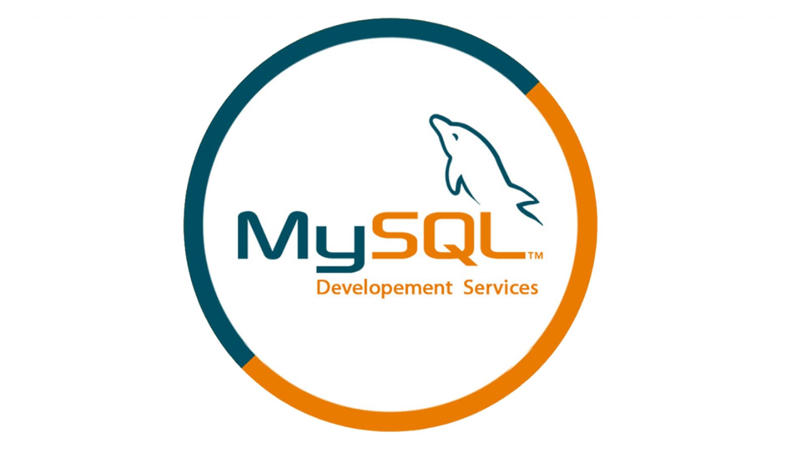

## 后端工程师—PLANB👋

热爱后端、热爱技术；实习经验半年；乐于阅读，分享技术文章。

### **社交主页：**

 

   <a href="https://planbbbbb.github.io/"><code></code></a>：个人博客：分享和学习技术，文章50+，总访客数800+

### **技术栈:**

<a href="https://www.java.com/zh-CN/"><code></code></a>
<a href="https://spring.io/"><code></code></a>
<a href="https://www.mysql.com/"><code></code></a>
<a href="https://redis.io/"><code></code></a>
<a href="https://www.rabbitmq.com/"><code></code></a>
<a href="https://www.elastic.co/cn/"><code></code></a>
<a href="https://v3.cn.vuejs.org"><code></code></a>
<a href="https://mybatis.org/mybatis-3/"><code></code></a>
<a href="https://www.docker.com"><code></code></a>

### 开源项目

   

### Github 活跃度

