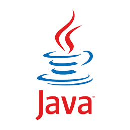
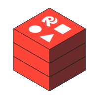

## 软件开发工程师—PlanB👋

2 年软件开发经验，专注于构建稳定、高效的系统，注重代码质量与长期价值，追求系统性能、可维护性与工程规范。

### **社交主页：**

   <a href="https://planbbbbb.github.io/"><code></code></a>：个人博客：记录学习过程中的项目实践与技术沉淀
### **技术栈:**

<a href="https://www.java.com/zh-CN/"><code></code></a>
<a href="https://spring.io/"><code></code></a>
<a href="https://www.mysql.com/"><code></code></a>
<a href="https://redis.io/"><code></code></a>
<a href="https://www.rabbitmq.com/"><code></code></a>
<a href="https://www.elastic.co/cn/"><code></code></a>
<a href="https://v3.cn.vuejs.org"><code></code></a>
<a href="https://mybatis.org/mybatis-3/"><code></code></a>
<a href="https://www.docker.com"><code></code></a>

### 开源项目

